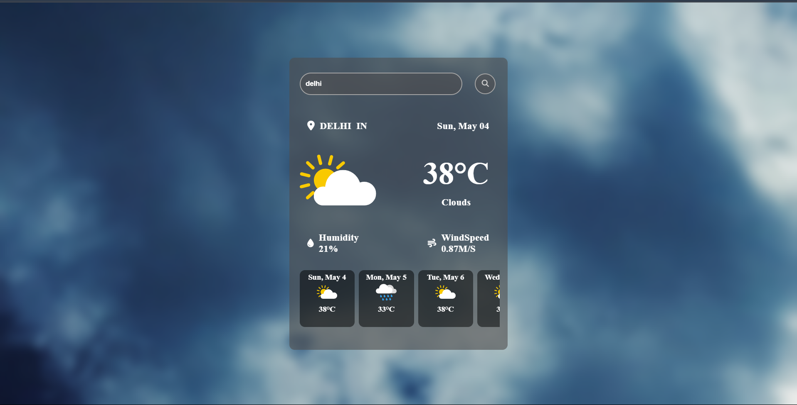

# 🌤️ Weather App

A responsive and interactive weather forecast web application that displays current weather details and a 5-day forecast based on the city entered by the user.



---

## 🚀 Features

- 🔍 Search weather by city name  
- 📅 Displays current day and date  
- 🌡 Shows temperature, humidity, and wind speed  
- 📈 5-day weather forecast  
- 🎨 Dynamic background changes based on weather condition  
- ⚠️ Displays error message for invalid city names  
- 💡 Shows placeholder image when no city is entered  
- ✨ Smooth hover effects and transition animations  

---

## 🛠️ Tech Stack

- **HTML5**  
- **CSS3** (Flexbox/Grid, transitions)  
- **JavaScript** (DOM manipulation, Fetch API)  
- **OpenWeatherMap API**

---

## 📂 Project Structure

```
weather-app/
│
├── index.html           # Main HTML file
├── style.css            # Styling file
├── script.js            # Main JS logic and API handling
├── assets/              # Images and icons
│   └── search-city.png
```

---

## 🧪 Getting Started

1. **Clone this repository**
   ```bash
   git clone https://github.com/your-username/weather-app.git
   cd weather-app
   ```

2. **Open `index.html` in a browser**  
   You can just double-click the file or use:
   ```bash
   open index.html   # Mac
   start index.html  # Windows
   ```

3. **Search for a city** to see the weather details.

---

## ⚙️ Configuration

1. Sign up at [OpenWeatherMap](https://openweathermap.org/) and get your API key.
2. In `script.js`, replace the placeholder with your own key:

```js
const apiKey = 'YOUR_API_KEY_HERE';
```

---


## 🎨 Customization

- Fonts used: [Poppins](https://fonts.google.com/specimen/Poppins), [Space Grotesk](https://fonts.google.com/specimen/Space+Grotesk)  
- You can modify fonts in `style.css`:

```css
body {
    font-family: 'Poppins', sans-serif;
}
```

- Background changes are based on current weather fetched from the API.  
- Add more weather icons/backgrounds in the `assets/` folder if needed.

---

## ✅ Future Enhancements

- [ ] Toggle between °C and °F  
- [ ] Add weather by geolocation  
- [ ] Add loading spinner while fetching  
- [ ] Improve mobile responsiveness  
- [ ] Store recent searches  

---

## 📄 License

This project is licensed under the MIT License - see the [LICENSE](LICENSE) file for details.

---

## 🙌 Acknowledgements

- Weather Data from [OpenWeatherMap](https://openweathermap.org/)  
- UI icons from [Font Awesome](https://fontawesome.com/)
